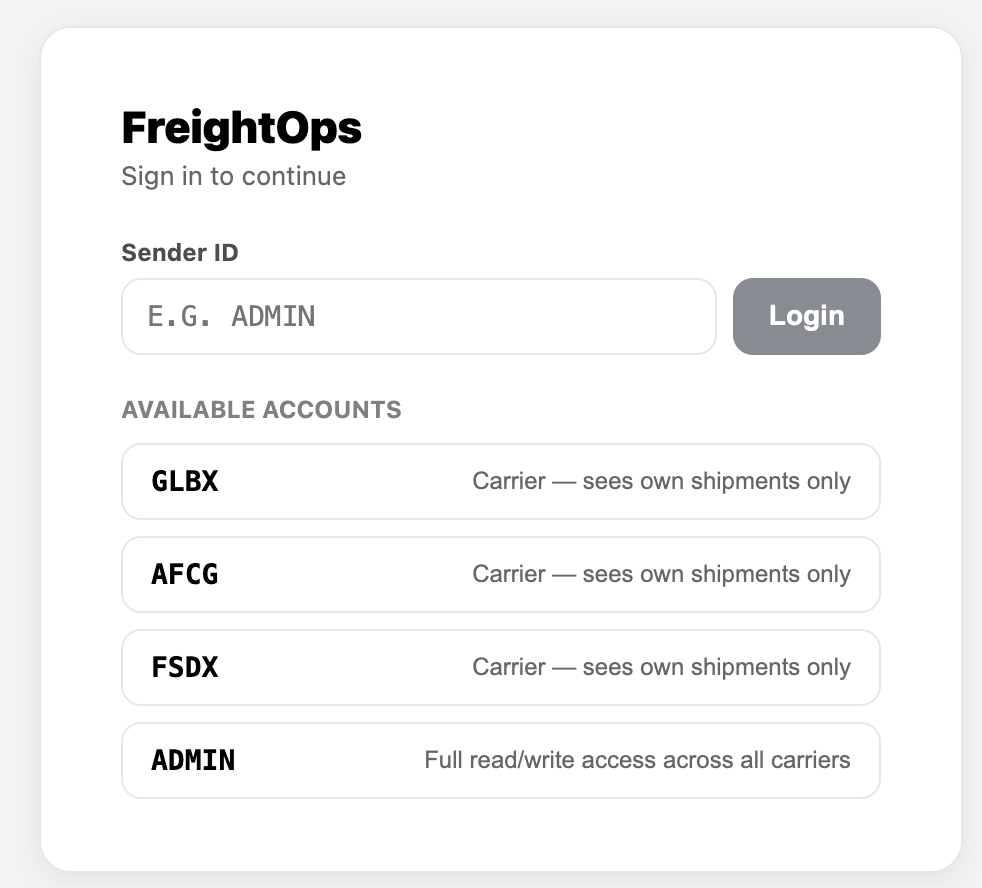
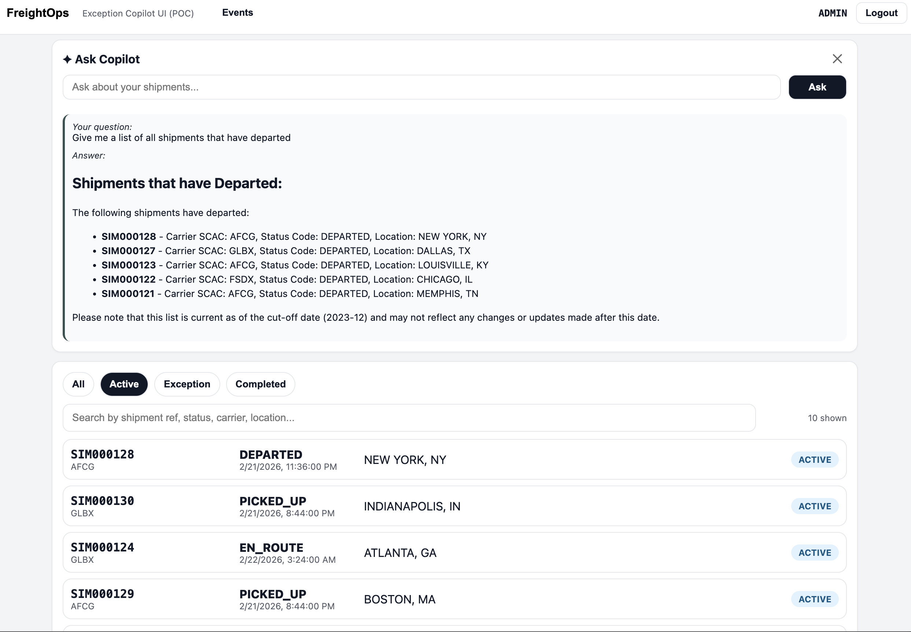
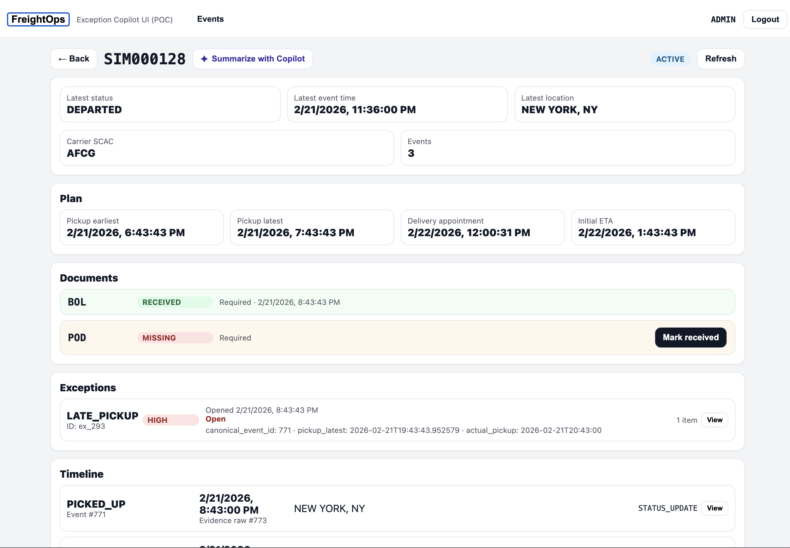
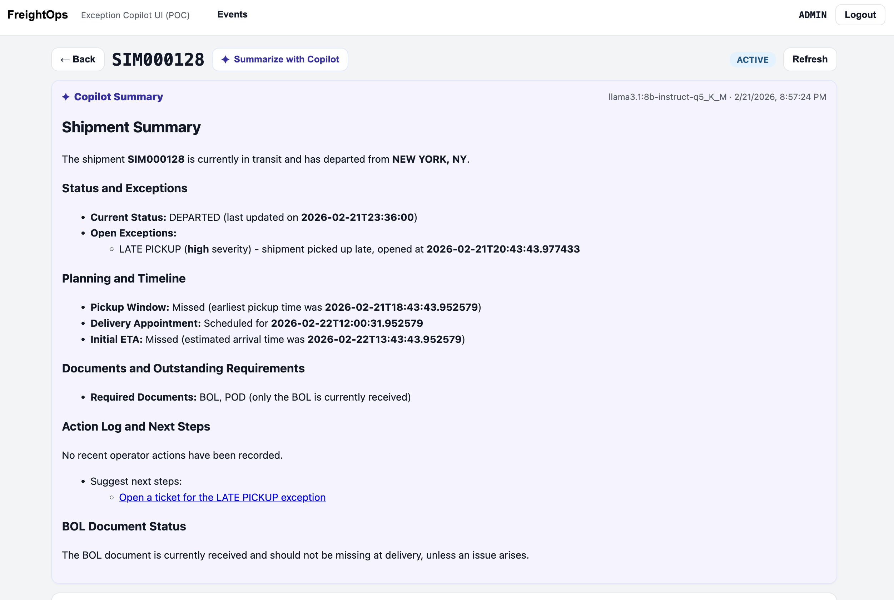
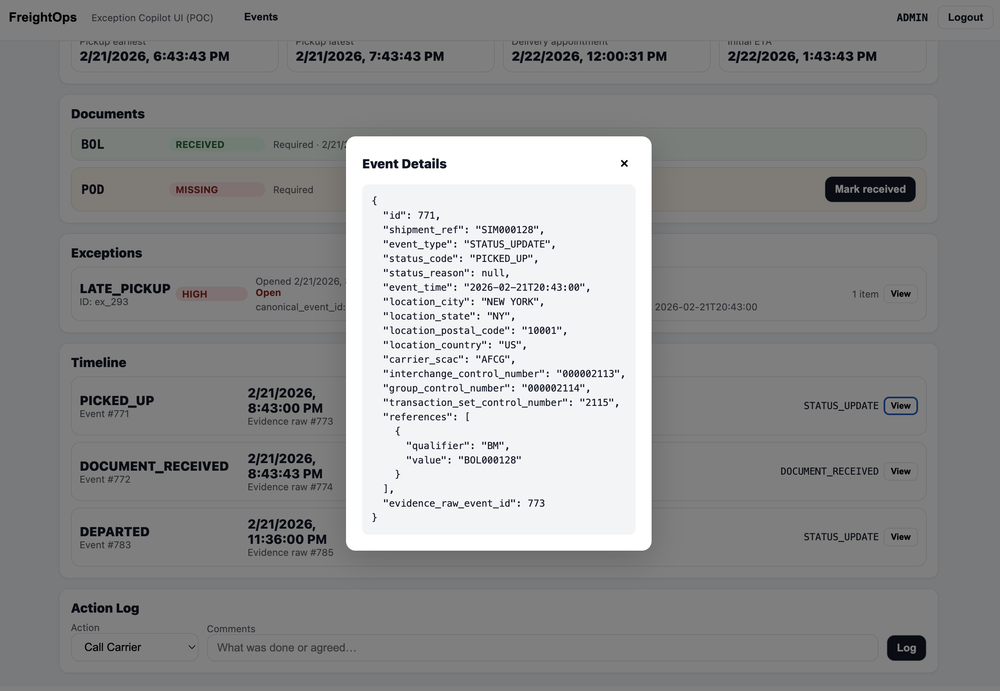

# FreightOps Exception Copilot UI

A React (Vite + TypeScript) UI for the `freightops_214` FastAPI backend. Provides a real-time exception tracking and operations dashboard with AI Copilot integration backed by a local Ollama server.

## Quickstart

```bash
npm install
npm run dev
```

Set `VITE_API_BASE_URL` in a `.env` file to point at your backend (default: `http://localhost:8000`).

---

## Authentication

The app requires a sender code to log in. On first load, a login screen is shown.

```
POST /auth/login   body: { "sender": "GLBX" }
                   returns: { "token": "...", "sender": "GLBX" }
```

Valid senders:
| Sender | Access |
|--------|--------|
| `GLBX` | Own shipments only |
| `AFCG` | Own shipments only |
| `FSDX` | Own shipments only |
| `ADMIN` | All shipments |

The JWT token is attached as `Authorization: Bearer <token>` on every subsequent request. The token is stored in memory only (cleared on logout or page refresh).

---

## Pages

### Shipments List (`/`)

Fetches all shipments once from `GET /shipments` and filters client-side.

- **Filter tabs**: All · Active (default) · Exception · Completed
- **Search**: free-text over shipment ref, status code, carrier SCAC, city, state
- **Ask Copilot**: expandable panel to ask free-form questions about your shipments; answers rendered as HTML with a running conversation transcript (newest first)

### Shipment Detail

Opens when a row is clicked. Runs 7 parallel API calls on load:

| Section | Endpoint |
|---------|----------|
| Header / Current State | `GET /shipments/{ref}` |
| Plan | `GET /shipments/{ref}/plan` |
| Documents | `GET /shipments/{ref}/documents` + plan's `required_documents` |
| ETA History | `GET /shipments/{ref}/eta` |
| Exceptions | `GET /shipments/{ref}/exceptions` |
| Timeline | `GET /shipments/{ref}/events` |
| Action Log | `GET /shipments/{ref}/action-log` |

**✦ Summarize with Copilot** button in the header calls `GET /shipments/{ref}/copilot` and renders the HTML summary inline.

Each **Timeline** row and each **Exception** row has a **View** button that opens a full JSON popup for the underlying object.

**Action Log** supports creating entries with types: `CALL_CARRIER`, `SEND_EMAIL`, `CREATE_TICKET`, `NOTE`. The actor is resolved server-side from the JWT.

### Events Inspector

Accessible from the top navigation. Shows all three event layers side-by-side with a configurable row limit and a **View** JSON popup on each row.

| Tab | Endpoint |
|-----|----------|
| Raw Events | `GET /events/raw?limit=N` |
| Canonical Events | `GET /events/canonical?limit=N` |
| Sanitized Events | `GET /events/sanitized?limit=N` |

---

## AI Copilot

Two copilot endpoints are used:

### `POST /copilot` — Fleet-wide Q&A
Ask free-form questions about your shipments. Ollama calls `list_shipments` / `get_shipment` tools internally, both scoped to the caller's sender code.

```json
// Request
{ "question": "Which shipments are at risk of missing their delivery appointment?" }

// Response
{ "answer": "<html>...</html>" }
```

### `GET /shipments/{ref}/copilot` — Per-shipment summary
Returns an AI-generated plain-language summary covering status, exceptions, planning milestones, ETA drift, documents, and action log.

```json
{
  "shipment_ref": "PRO123",
  "summary": "<html>...</html>",
  "model": "llama3.2",
  "generated_at": "2026-02-21T12:00:00Z"
}
```

Both responses are rendered as HTML with `<script>` tags escaped.

---

## API Reference

### Auth
| Method | Path | Description |
|--------|------|-------------|
| `POST` | `/auth/login` | Exchange sender code for JWT |

### Shipments
| Method | Path | Description |
|--------|------|-------------|
| `GET` | `/shipments` | List all shipments (flat shape, client-side filtered) |
| `GET` | `/shipments/{ref}` | Single shipment detail |
| `GET` | `/shipments/{ref}/events` | Canonical event timeline |
| `GET` | `/shipments/{ref}/exceptions` | Rules-engine exception records |
| `GET` | `/shipments/{ref}/plan` | Pickup window, delivery appointment, initial ETA, required docs |
| `POST`| `/shipments/{ref}/plan` | Create/replace plan |
| `GET` | `/shipments/{ref}/eta` | ETA update history |
| `POST`| `/shipments/{ref}/eta` | Record a new ETA estimate |
| `GET` | `/shipments/{ref}/documents` | Document receipt status |
| `GET` | `/shipments/{ref}/action-log` | Operator action log |
| `POST`| `/shipments/{ref}/action-log` | Create action log entry |
| `GET` | `/shipments/{ref}/copilot` | AI per-shipment summary |

### Events
| Method | Path | Description |
|--------|------|-------------|
| `GET` | `/events/raw?limit=N` | Raw inbound events (immutable) |
| `GET` | `/events/canonical?limit=N` | Normalized canonical events |
| `GET` | `/events/sanitized?limit=N` | Validated + deduplicated events |

### Copilot
| Method | Path | Description |
|--------|------|-------------|
| `POST` | `/copilot` | Ask a free-form question about your shipments |

---

## Status Classification

Shipments are categorized client-side in `src/domain/status.ts`:

| Category | Status codes |
|----------|-------------|
| **Completed** | `DELIVERED`, `CANCELLED`, `RETURNED` |
| **Exception** | `DELAYED`, `DELIVERY_ATTEMPTED`, `DELIVERY_FAILED`, `APPOINTMENT_MISSED`, `EXCEPTION` |
| **Active** | everything else |

---

## Project Structure

```
src/
  api/
    client.ts          # All API types + fetch functions, auth token management
  domain/
    status.ts          # categorizeStatus() — maps status_code → active|exception|completed
  ui/
    App.tsx            # Auth gate, routing, top navigation
    LoginPage.tsx      # Sender code login with quick-select buttons
    ShipmentsPage.tsx  # Shipments list, filters, Ask Copilot panel
    ShipmentDetailPage.tsx  # Full detail view with all sections + JSON popups
    EventsPage.tsx     # Raw / Canonical / Sanitized event inspector
    components.tsx     # Card, Badge, Button, Mono, SmallMuted, Input primitives
```

---

## Screenshots










